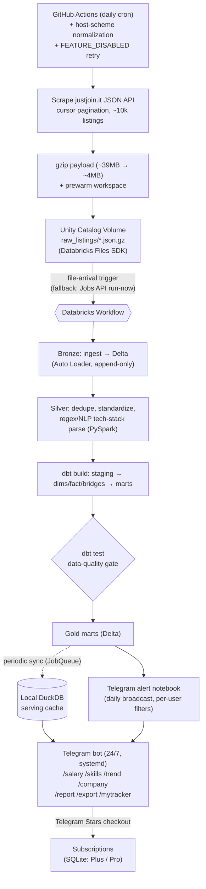
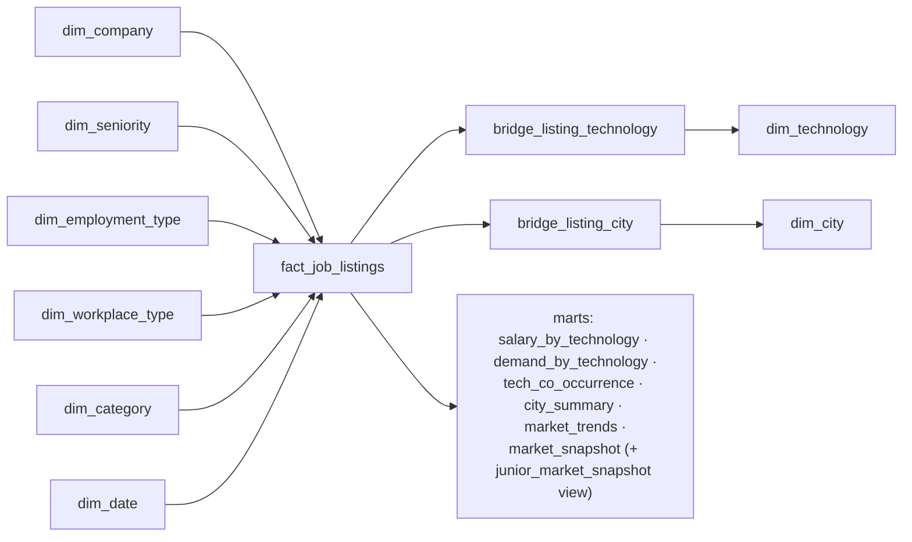

# Polish IT Job Market Intelligence

An end-to-end **lakehouse data platform + monetizable product** for Poland's IT job market — built as a production-style portfolio project, not a tutorial. A scheduled scraper feeds a Databricks medallion pipeline (bronze → silver → gold star schema via PySpark + dbt), and the gold marts power an **interactive Telegram bot** with free job alerts and a paid analytics tier (salary insights, skill co-occurrence, company intel, an application tracker) billed in **Telegram Stars**.

[](https://github.com/kromylodd/Polish-It-Job-Market-Intelligence/actions/workflows/ci.yml)
[](https://github.com/kromylodd/Polish-It-Job-Market-Intelligence/actions/workflows/scrape.yml)
[](#testing)
[](#tech-stack)

> **Stage 3 companion** to the [Polish Housing Market Intelligence Platform](https://github.com/kromylodd/Polish-Housing-Market-Intelligence-Platform) — deliberately built on a **different stack** (Databricks / PySpark / Delta Lake / Asset Bundles vs. GCP / BigQuery / Airflow / Terraform) to demonstrate cross-platform fluency, then taken one step further: this one ships a **user-facing product with a payment layer** on top of the warehouse.

**Status: pipeline + product both live.** Scraper → gzip upload to Unity Catalog Volume → Databricks Workflow (bronze → silver → dbt star schema → dbt tests → Telegram alert) runs daily via GitHub Actions; the interactive Telegram bot runs 24/7 as a systemd service with a local DuckDB serving cache for sub-second premium analytics. See [Known Limitations](#known-limitations--honest-caveats) for the honest caveats.

---

## Table of Contents

- [Motivation](#motivation)
- [Architecture](#architecture)
- [Tech Stack](#tech-stack)
- [Key Differentiators vs. Project #1](#key-differentiators-vs-project-1-housing)
- [The Product: Telegram Bot](#the-product-telegram-bot)
- [Monetization (Telegram Stars)](#monetization-telegram-stars)
- [The Serving Layer: Why a Local DuckDB Cache](#the-serving-layer-why-a-local-duckdb-cache)
- [Data Model](#data-model)
- [Reliability Engineering](#reliability-engineering-the-hard-parts)
- [Project Structure](#project-structure)
- [CI/CD](#cicd)
- [Deployment](#deployment)
- [Testing](#testing)
- [Setup](#setup)
- [Known Limitations / Honest Caveats](#known-limitations--honest-caveats)
- [Roadmap](#roadmap)
- [Scraping Ethics](#scraping-ethics)
- [Disclaimer](#disclaimer)

## Motivation

Most portfolio data projects stop at "scrape → warehouse → dashboard nobody opens." This one closes the loop to an actual **product a user interacts with daily**: it answers "what should I learn, where should I apply, and what should I earn?" for the Polish IT market, and it has a real (if small-scale) revenue model. The engineering underneath is built the way an internal analytics platform would be — a medallion lakehouse, a Kimball-style star schema with many-to-many bridge tables, a data-quality gate, IaC, and CI/CD — but the consumption layer is a push-based Telegram bot instead of a pull-based BI dashboard, because that's what actually gets used by job seekers.

It also intentionally uses a completely different toolchain from my [first data platform](https://github.com/kromylodd/Polish-Housing-Market-Intelligence-Platform), so the two projects together show I can design the same class of system on both a GCP-native and a Databricks-native stack rather than knowing exactly one vendor.

## Architecture



Two independent tracks drive value from the same gold marts:

- **Batch (daily):** GitHub Actions scrapes and uploads; the Databricks Workflow transforms and gates; the final task broadcasts filtered alerts to every subscriber. Tolerant of Databricks Free-Edition throttling because it's asynchronous and retried.
- **Interactive (24/7):** the Telegram bot serves on-demand premium analytics from a **local DuckDB cache** of the gold marts, so a user query never waits on a cold Databricks warehouse.

## Tech Stack

| Category | Tools |
|---|---|
| Language | Python 3.12 |
| Platform | Databricks Free Edition (Unity Catalog, Delta Lake) |
| Ingestion | GitHub Actions + Databricks Files SDK (gzip + prewarm) |
| Transformation | PySpark (bronze/silver), regex/NLP tech-stack parsing |
| Modeling | dbt-databricks — star schema with many-to-many bridge tables |
| Orchestration | Databricks Workflows (Lakeflow Jobs), file-arrival trigger |
| IaC | Databricks Asset Bundles |
| CI/CD | GitHub Actions (lint, format, tests, dbt-parse, bundle deploy) |
| Data Quality | dbt tests (a different DQ approach vs. Great Expectations in project #1) |
| Product | python-telegram-bot 21.5 (long-polling, JobQueue, inline menus) |
| Serving cache | DuckDB (local mirror of gold marts for sub-second queries) |
| Payments | Telegram Stars (`currency=XTR`, no third-party provider) |
| Bot state | SQLite (subscriptions, payments, application tracker, analytics) |
| Charts | matplotlib (Agg backend, headless PNG) |
| Bot hosting | systemd service (Docker image also provided) |

## Key Differentiators vs. Project #1 (Housing)

- **Lakehouse** (Databricks / Unity Catalog / Delta) instead of GCP-native (BigQuery / GCS).
- **PySpark** transformation instead of pandas/SQL-only.
- **Databricks Workflows** instead of Airflow — a second orchestrator.
- **Databricks Asset Bundles** instead of Terraform — a second IaC tool.
- **Many-to-many bridge tables** (technology, city) — a star-schema pattern project #1 didn't need.
- **A shipped product with a payment layer** — not just a dashboard. Telegram bot + Stars monetization + retention features.
- **A two-tier serving architecture** (batch warehouse + local analytical cache) — an explicit latency/reliability decision project #1 didn't require.

## The Product: Telegram Bot

The gold marts aren't just for a dashboard — they back a live bot ([@polish_it_jobs_bot](https://t.me/polish_it_jobs_bot)) that job seekers actually use.

**Free (for everyone):**
- Daily push alerts of new listings matching per-user filters.
- A full universal filter system with **tolerance matching** — 7 dimensions (seniority, technologies, categories, workplace, employment type, min salary, cities) where the user sets how many dimensions are allowed to mismatch (`0` = strict, `1+` = flexible). Edited via an interactive inline-keyboard menu (`/filters`).
- `/myskills python sql airflow` — save your stack; `/latest` results get **ranked by % skill overlap** (a simple, explainable recommendation layer — no ML needed, but it reads like one).

**Premium (`/premium` menu, billed in Telegram Stars):**
- `/salary Python [senior]` — median plus a **P25–P75 typical range**, broken out **by contract type** (permanent/UoP vs B2B vs mandate), plus a per-seniority breakdown, from `mart_salary_by_technology`. Salary is period-normalized to a monthly basis upstream (per-hour/day/year quotes converted in `fact_job_listings`), so B2B and UoP are directly comparable — they're shown separately because they're genuinely different comp, not because of a units mismatch.
- `/skills Python` — "often requested with: SQL 71%, Airflow 43% …" from `mart_tech_co_occurrence`. **This is the standout feature — no other Polish job-alert bot does technology co-occurrence.**
- `/trend [tech]` — market-wide or per-technology demand trends, rendered as matplotlib charts.
- `/company Allegro` — how many current listings, salary range, sample roles.
- `/report` — a weekly market report (top hiring companies, hottest tech WoW, salary trend) + chart.
- `/export` — the user's filtered listings as a CSV.
- **Application tracker** — one-tap `✅ Applied / 👀 Interested / ❌ Rejected` buttons under each listing (and `/applied`, `/mytracker`). This is the main *retention* lever — it turns a broadcast channel into a personal tool users keep coming back to.

The `/premium` menu mirrors the free `/filters` menu: an inline keyboard where keyword-driven items show usage and action items run immediately — one shared code path behind both the slash command and the button.

## Monetization (Telegram Stars)

Payments use **Telegram Stars** (`currency="XTR"`, empty provider token) — no Stripe, no third-party processor, checkout handled inside Telegram. The full flow is wired: `send_invoice` → `PreCheckoutQuery` approval → `successful_payment` → subscription activation, with idempotent charge logging. The subscription **lifecycle** is handled too: a post-expiry **grace period** keeps access alive while a background job sends **renewal reminders**, and an admin `/refund <charge_id>` issues a Telegram Stars refund (`refundStarPayment`) and revokes access.

| Tier | Price | What you get |
|---|---|---|
| **Free** | — | Daily digest + all filters (up to 20 listings/run) |
| **Plus** | 250 ⭐ / 30 days | Saved-filter push, `/latest` on demand, `/salary`, `/trend`, up to 50 listings/run |
| **Pro** | 600 ⭐ / 30 days | Everything in Plus + `/skills` co-occurrence, `/company` intel, `/export`, application tracker, weekly report, up to 100 listings/run |

Feature gating respects a tier hierarchy (Pro ⊇ Plus), persisted in SQLite with expiry. Paid tiers also raise the per-run listing cap (free 20 → Plus 50 → Pro 100); the bot stamps each user's cap into the shared config so the GitHub Actions / Databricks broadcast senders honour it without touching the subscription store. The pricing is deliberately structured so **Pro needs only ~3–4 subscribers to match the net revenue of ~9 Plus subscribers** — selling fewer, more valuable subscriptions rather than racing to the bottom.

## The Serving Layer: Why a Local DuckDB Cache

The single most interesting engineering decision in the project.

**Problem:** premium commands must answer in well under a second, but Databricks Free Edition warehouses go cold and can take *tens of seconds* to wake — or get throttled entirely (`FEATURE_DISABLED`). Querying the warehouse per user request is a non-starter.

**Insight:** everything the premium commands need is already precomputed by dbt as **small** gold marts (hundreds to a few thousand rows). So the bot doesn't query Databricks live — it periodically **syncs those marts into a local DuckDB file** (`serving.py`, via the JobQueue on startup + every 6h, or the admin `/refresh`), and answers every premium query from DuckDB. Instant, offline-capable, and immune to warehouse cold starts. If a sync fails, the cache simply stays as-is and the command degrades to a friendly "data not ready" instead of hanging.

This is a deliberate **two-tier read architecture**: Databricks is the batch compute + system of record; DuckDB is a disposable, rebuildable read-cache co-located with the app. Same pattern as a materialized-view cache in front of a slow warehouse, at portfolio scale.

## Data Model

**Medallion architecture** (Unity Catalog schemas):
- `bronze` — raw ingested Delta tables, append-only (Auto Loader reads `.json.gz` transparently).
- `silver` — cleaned, deduplicated, tech-parsed listings.
- `gold` — star schema: dimensions, fact, bridges, and analytical marts.

**Star schema (gold):**



A single listing can require many technologies and span multiple cities, so `bridge_listing_technology` and `bridge_listing_city` model those many-to-many relationships rather than flattening or exploding the fact table.

**Marts (each backs a bot command):**

| Mart | Powers |
|---|---|
| `mart_salary_by_technology` | `/salary <tech>` — percentiles per tech/seniority/contract |
| `mart_tech_co_occurrence` | `/skills <tech>` — which technologies appear together |
| `mart_demand_by_technology` | `/trend <tech>` — weekly demand + WoW change |
| `mart_market_trends` | `/trend`, `/report` — rolling volume & salary trend |
| `mart_city_summary` | city-level listings & salary rollups |
| `mart_market_snapshot` | daily alerts + `/latest` + `/company` (all seniorities) |
| `mart_junior_market_snapshot` | junior-only view over `mart_market_snapshot` (backward-compat) |

## Reliability Engineering (the hard parts)

Real failures hit and fixed during development — the interesting part of a data product isn't the happy path:

- **Daily-scrape 404 → `KeyError: 'run_id'`.** Two stacked root causes: (1) the `DATABRICKS_HOST` secret is a bare hostname, so a raw `curl` produced a scheme-less URL — fixed by normalizing the host in-workflow; (2) Databricks Free Edition intermittently returns `FEATURE_DISABLED` on job triggers — fixed by making the trigger step retry with backoff (treating `FEATURE_DISABLED`/429/5xx as transient, failing fast on 401/403/bad-job-id).
- **Cold-warehouse hang froze the bot.** On-demand commands (`/latest`, `/export`, `/stats`) used the SQL connector's **default 900-second retry**; against a cold warehouse each call blocked a worker thread for up to 15 minutes, and stacking them starved the thread pool. Fixed by bounding the retry (25s on-demand, 90s for the background sync) so calls fail fast and fall back to local data. The same non-daemon-thread issue was also blocking clean process shutdown — bounding the sync retry fixed that too.
- **Upload flakiness from GitHub → cold Free-Edition workspace.** A ~39 MB JSON stalled mid-transfer on TLS churn; fixed by **gzipping the payload (~10×)** and **prewarming** the workspace with a cheap retried call before the big upload. (Auto Loader reads `.json.gz` by extension, so bronze ingestion is unchanged.)
- **Masked dbt failures showing green.** The notebook runners called `dbutils.notebook.exit("FAILED…")`, which terminates a task as *success*; a real failing snapshot/test was silently skipping every downstream mart. Fixed to `raise` on failure and demote a dirty-data test to `warn` so bad rows don't block the whole build.
- **Multi-user & idempotency bugs.** Per-user config isolation (atomic writes, no shared-list mutation), a per-`(listing, chat)` idempotency log so alerts never duplicate, and numpy-array normalization from the SQL connector.

## Project Structure

```
polish-it-job-market-intelligence/
├── databricks.yml                 # Asset Bundle root config
├── resources/
│   ├── jobs.yml                    # Databricks Workflow: bronze→silver→dbt→test→alert
│   ├── dashboards.yml              # Lakeview dashboard resource (BI companion)
│   └── volumes.yml                 # Unity Catalog Volume definition
├── dashboards/
│   └── job_market_overview.lvdash.json  # Lakeview dashboard over the gold marts
├── scraper/
│   ├── scraper.py                  # justjoin.it JSON API, cursor pagination, retries
│   ├── parser.py                   # typed field extraction + normalization
│   ├── uploader.py                 # gzip + prewarm + bounded-retry upload to Volume
│   └── tests/                      # parser unit tests
├── notebooks/
│   ├── 01_bronze_ingest.py         # Auto Loader → Delta bronze
│   ├── 02_silver_clean.py          # dedupe / standardize
│   ├── 03_silver_tech_parse.py     # regex/NLP tech-stack parsing
│   ├── run_dbt.py / run_dbt_test.py# dbt build/test on serverless (raise on failure)
│   └── 04_alert_telegram.py        # daily broadcast with per-user filters
├── dbt/
│   ├── models/staging/             # stg_listings
│   ├── models/marts/{dims,facts,bridges,analytics}/  # star schema + 6 marts
│   ├── snapshots/ · tests/ · seeds/
│   └── profiles.yml                # env-var driven (no hardcoded infra ids)
├── telegram_bot/
│   ├── bot.py                      # commands, inline menus, payment flow, JobQueue sync
│   ├── filters.py                  # universal tolerance-matching filter logic
│   ├── serving.py                  # DuckDB serving cache + analytics query helpers
│   ├── payments.py                 # Telegram Stars subscriptions (SQLite)
│   ├── tracker.py                  # application tracker (SQLite)
│   ├── reports.py                  # weekly report + matplotlib charts
│   ├── notify.py / config_store.py / analytics.py
│   └── tests/                      # filters, analytics, config, serving, tracker, payments
├── deploy/
│   ├── Dockerfile                  # bot image (non-root, headless matplotlib)
│   ├── telegram-bot.service        # systemd unit
│   └── README.md                   # GCP e2-micro free-tier hosting guide
└── .github/workflows/
    ├── ci.yml                      # lint, format, tests, dbt-parse
    ├── scrape.yml                  # daily scrape → upload → trigger → poll → notify
    └── deploy-bundle.yml           # databricks bundle deploy
```

## CI/CD

**`.github/workflows/ci.yml`** — on every push/PR to `main`:

| Job | What it does |
|---|---|
| `lint-and-test` | `ruff check .`, `ruff format --check .`, `black --check .`, `pytest` (89 tests) |
| `dbt-parse` | `dbt deps` + `dbt parse` (pinned dbt-databricks) to catch model errors early |

**`.github/workflows/scrape.yml`** — daily (06:00 UTC) + manual: scrape → gzip upload → **trigger the Databricks job via the Jobs API with host normalization and `FEATURE_DISABLED` retry** → poll the run to completion → run the Telegram notifier only once gold data is ready.

**`.github/workflows/deploy-bundle.yml`** — `databricks bundle deploy` (manual/CD). Auth is via a Databricks PAT stored as a GitHub encrypted secret — see [Known Limitations](#known-limitations--honest-caveats) for why not keyless OIDC here.

## Deployment

The bot is long-polling (no inbound ports), so any always-on Linux box works.

- **systemd (used now):** runs as a user service on the host, `Restart=on-failure`, `loginctl enable-linger` so it survives logout/reboot. See `deploy/telegram-bot.service`.
- **Docker:** `deploy/Dockerfile` builds a non-root image with a persistent volume for the SQLite stores + DuckDB cache.
- **24/7 recommendation:** GCP `e2-micro` free tier (Debian 12, `us-west1`) — full guide in `deploy/README.md`.

## Testing

```bash
pip install -r telegram_bot/requirements.txt
pytest -q            # 89 tests: scraper parser, filters, analytics, config,
                     # serving layer, application tracker, Stars payments, reports
```

The serving/reports tests seed a temporary DuckDB with sample marts so the analytics helpers (weighted salary aggregation, co-occurrence %, skill ranking, chart PNG generation) are exercised for real, not skipped. `requirements-ci.txt` includes duckdb + matplotlib so CI runs them too.

## Setup

### Prerequisites
- Databricks Free Edition workspace + Databricks CLI (`databricks configure`)
- Python 3.12
- A Telegram bot token (via [@BotFather](https://t.me/BotFather))

### Pipeline
```bash
git clone https://github.com/kromylodd/Polish-It-Job-Market-Intelligence.git
cd polish-it-job-market-intelligence
pip install -r requirements-dev.txt
databricks bundle validate
databricks bundle deploy -t prod
```

### Bot (local)
```bash
pip install -r telegram_bot/requirements.txt
set -a && source .env && set +a          # TELEGRAM_BOT_TOKEN, DATABRICKS_*, ANALYTICS_SALT
python3 -m telegram_bot.bot
```

Key env vars: `TELEGRAM_BOT_TOKEN`, `TELEGRAM_CHAT_ID` (admin), `ANALYTICS_SALT`, `DATABRICKS_HOST/TOKEN/WAREHOUSE_ID` (for the serving-cache sync), and optional tunables `SERVING_SYNC_INTERVAL_SECONDS`, `ONDEMAND_RETRY_SECONDS`, `SYNC_RETRY_MAX_SECONDS`.

## Known Limitations / Honest Caveats

Documented deliberately — a recruiter should see engineering judgment about trade-offs, not just green checkmarks.

- **Databricks Free Edition throttles.** Job triggers can return `FEATURE_DISABLED` and SQL warehouses go cold. The batch pipeline tolerates this via retries; the bot sidesteps it entirely with the DuckDB serving cache. But **premium analytics show "data not ready" until the warehouse is reachable for at least one successful sync**, and the batch pipeline can occasionally skip a day when Databricks is fully throttled.
- **No keyless (OIDC/WIF) CI auth.** Free Edition lacks the account-level API access needed for workload identity federation (the pattern used in project #1), so CI/CD uses a PAT in a GitHub secret. Documented trade-off, not an oversight.
- **Outbound networking from Databricks serverless is restricted.** Scraping and the interactive bot run outside Databricks (GitHub Actions / a systemd host), not inside serverless compute.
- **~10k listing cap per scrape** from justjoin.it's API pagination — a representative daily snapshot, not a full census, for the very largest result sets.
- **Payments are wired but lightly exercised.** The full Stars checkout flow is implemented and unit-tested — including a subscription lifecycle (post-expiry grace period, background renewal reminders, and admin-issued Stars refunds that revoke access) — but real-world volume is minimal, so it's a functioning MVP monetization path rather than a battle-tested billing system (no self-serve refund UI, no proration beyond simple stacking).
- **Bot hosting is a single node.** systemd on one host means no HA; if the host is down, alerts pause. Fine for the current scale; a managed always-on VM is the documented upgrade.

## Roadmap

- Trend chart cleanup: drop the partial first day so week-over-week isn't inflated.
- ~~Lakeview dashboard on the gold marts for a visual/BI companion to the bot.~~ ✅ Done — `dashboards/job_market_overview.lvdash.json`, deployed via the Asset Bundle (`resources/dashboards.yml`).
- ~~All-seniorities gold mart so premium alerts cover senior/mid, not just junior.~~ ✅ Done.
- ~~Real payment lifecycle: refunds, grace periods, renewal reminders.~~ ✅ Done.
- ~~Lower the scrape delay now that 429 `Retry-After` handling exists.~~ ✅ Done (0.5s).
- ~~Move the bot to a free-tier cloud VM for true 24/7 independence from a laptop.~~ ✅ Done — GCP `e2-micro` in `us-west1-b`.

## Scraping Ethics

- Only publicly available listing data via justjoin.it's own JSON API — no authenticated endpoints, no HTML scraping, no bypassing access controls.
- Requests are rate-limited (0.5s delay, env-tunable) with exponential backoff and `Retry-After` handling on 429s.
- Scope is search-results fields only.

## Disclaimer

This project scrapes only publicly available data for educational/portfolio purposes. It is not affiliated with justjoin.it. Salary and market figures are derived from public job postings and are not financial advice.
