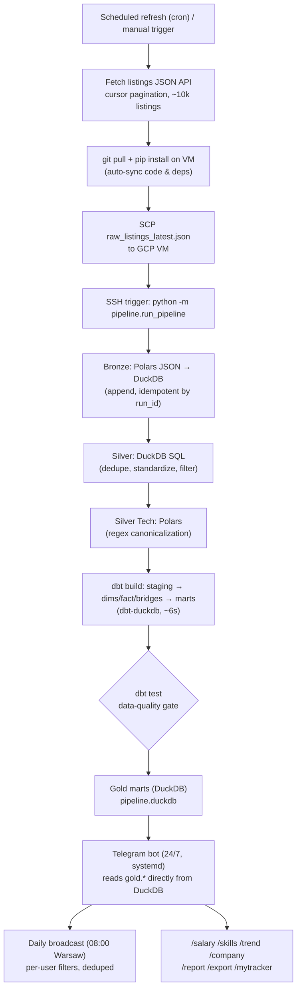
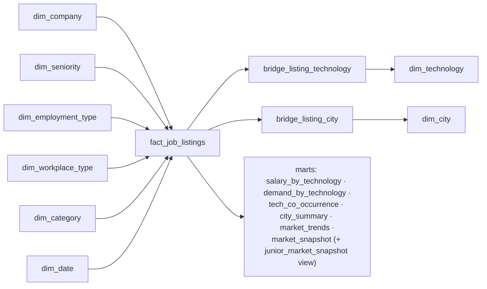

# Polish IT Job Market Intelligence

An end-to-end **data platform** for Poland's IT job market — built as a production-style portfolio project. A scheduled scraper feeds a self-hosted medallion pipeline (bronze → silver → gold star schema via Polars + DuckDB + dbt) on a GCP e2-micro VM, and the gold marts power an **interactive Telegram bot** with daily job alerts and analytics (salary insights, tech co-occurrence, company intel, application tracker).

[](https://github.com/kromylodd/Polish-It-Job-Market-Intelligence/actions/workflows/ci.yml)
[](#testing)
[](#tech-stack)

> **Stage 3 companion** to the [Polish Housing Market Intelligence Platform](https://github.com/kromylodd/Polish-Housing-Market-Intelligence-Platform) — deliberately built on a **different stack** (DuckDB / Polars / dbt-duckdb / systemd vs. GCP / BigQuery / Airflow / Terraform) to demonstrate cross-platform fluency, then taken one step further: this one ships a **user-facing product** on top of the warehouse.

**Status: live as a personal tool.** A scheduled refresh pulls the latest listings and runs the local pipeline (Polars + dbt-duckdb) on a GCP VM; the Telegram bot runs 24/7 as a systemd service, reading gold marts directly from the pipeline's DuckDB file. It runs for a **single user** (the author) as a personal job-hunting aid — all analytics features are free.

---

## Table of Contents

- [Motivation](#motivation)
- [Architecture](#architecture)
- [Tech Stack](#tech-stack)
- [Key Differentiators vs. Project #1](#key-differentiators-vs-project-1-housing)
- [The Product: Telegram Bot](#the-product-telegram-bot)
- [Payment Infrastructure (Telegram Stars)](#payment-infrastructure-telegram-stars)
- [The Serving Layer: Why a Single DuckDB File](#the-serving-layer-why-a-single-duckdb-file)
- [Data Model](#data-model)
- [Reliability Engineering](#reliability-engineering-the-hard-parts)
- [Project Structure](#project-structure)
- [CI/CD](#cicd)
- [Deployment](#deployment)
- [Testing](#testing)
- [Setup](#setup)
- [Known Limitations](#known-limitations)
- [Roadmap](#roadmap)
- [Scraping Ethics and Legal Posture](#scraping-ethics-and-legal-posture)
- [Disclaimer](#disclaimer)

## Motivation

Most portfolio data projects stop at "scrape → warehouse → dashboard nobody opens." This one closes the loop to an actual **product a user interacts with daily**: it answers "what should I learn, where should I apply, and what should I earn?" for the Polish IT market. The engineering underneath is built the way an internal analytics platform would be — a medallion lakehouse, a Kimball-style star schema with many-to-many bridge tables, a data-quality gate, and CI/CD — but the consumption layer is a push-based Telegram bot instead of a pull-based BI dashboard, because that's what actually gets used by job seekers.

It also intentionally uses a completely different toolchain from my [first data platform](https://github.com/kromylodd/Polish-Housing-Market-Intelligence-Platform), so the two projects together show I can design the same class of system on both a **GCP-native** stack and a **self-hosted DuckDB/Polars/dbt** stack. (This project began on Databricks Free Edition and was later migrated to the self-hosted pipeline — see [`docs/migration_plan.md`](docs/migration_plan.md).)

## Architecture



A single `pipeline.duckdb` file is both the warehouse and the serving layer:

- **Batch (scheduled):** a scheduled job refreshes the data on the VM and runs the local pipeline (Polars + dbt-duckdb, ~22s total). The gold marts land directly in the DuckDB file the bot reads.
- **Interactive (24/7):** the Telegram bot serves on-demand analytics from the same DuckDB file — no sync, no network, no cold starts. Sub-second response guaranteed.

## Tech Stack

| Category | Tools |
|---|---|
| Language | Python 3.12 |
| Pipeline processing | Polars 1.4 (bronze/silver), DuckDB 1.1 (analytical DB) |
| Modeling | dbt-duckdb — star schema with many-to-many bridge tables |
| Orchestration | GitHub Actions (scrape + SCP + SSH trigger) + systemd timer (fallback) |
| CI/CD | GitHub Actions (lint, format, tests, dbt-parse) |
| Data Quality | dbt tests (salary range, uniqueness, referential integrity) |
| Product | python-telegram-bot 21.5 (long-polling, JobQueue, inline menus) |
| Serving | DuckDB (bot reads gold.* tables directly from pipeline output) |
| Payments | Telegram Stars (`currency=XTR`, no third-party provider) — built, currently bypassed |
| Bot state | SQLite (subscriptions, payments, application tracker, analytics, alert idempotency) — all `0600` via a shared connection helper |
| Charts | matplotlib (Agg backend, headless PNG) |
| Hosting | GCP e2-micro free tier (systemd services for bot + pipeline) |

## Key Differentiators vs. Project #1 (Housing)

- **Self-hosted analytical pipeline** (Polars + DuckDB + dbt-duckdb) instead of GCP-native (BigQuery / GCS / Airflow / Terraform).
- **Single-file analytical database** (DuckDB) serves both pipeline and application — no separate warehouse vs. cache.
- **Many-to-many bridge tables** (technology, city) — a star-schema pattern project #1 didn't need.
- **A shipped product with a payment layer** — not just a dashboard. Telegram bot + Stars payment flow + retention features.
- **Zero-dependency serving** — the bot reads directly from the pipeline's DuckDB output with no network, sync, or external service needed at query time.
- **Full migration story** — started on Databricks Free Edition, migrated to self-hosted when commercial ToS restrictions became a blocker. Architecture decisions documented.

## The Product: Telegram Bot

The gold marts back a live bot that runs 24/7 on the GCP VM. Currently operates as a **personal tool** (single user) — all features are free (the `PREMIUM_FREE` flag bypasses the paywall while the bot runs in personal mode).

**All features (free for all users):**
- Daily push alerts of new listings matching per-user filters (08:00 Warsaw, deduped).
- A full universal filter system with **tolerance matching** — 7 dimensions (seniority, technologies, categories, workplace, employment type, min salary, cities) where the user sets how many dimensions are allowed to mismatch (`0` = strict, `1+` = flexible). Edited via an interactive inline-keyboard menu (`/filters`).
- `/myskills python sql airflow` — save your stack; `/latest` results get **ranked by % skill overlap** (a simple, explainable recommendation layer).
- `/salary Python [senior]` — median plus a **P25–P75 typical range**, broken out **by contract type** (permanent/UoP vs B2B vs mandate), plus a per-seniority breakdown. Salary is period-normalized to a monthly basis upstream (per-hour/day/year quotes converted in `fact_job_listings`), so B2B and UoP are directly comparable.
- `/skills Python` — "often requested with: SQL 71%, Airflow 43% …" from `mart_tech_co_occurrence`. **This is the standout feature — no other Polish job-alert bot does technology co-occurrence.**
- `/trend [tech]` — market-wide or per-technology demand trends, rendered as matplotlib charts.
- `/company Allegro` — how many current listings, salary range, sample roles.
- `/report` — a weekly market report (top hiring companies, hottest tech WoW, salary trend) + chart.
- `/export` — filtered listings as a CSV.
- **Application tracker** — one-tap `✅ Applied / 👀 Interested / ❌ Rejected` buttons under each listing (and `/applied`, `/mytracker` with paginated history). This is the main *retention* lever — it turns a broadcast channel into a personal tool users keep coming back to.

## Payment Infrastructure (Telegram Stars)

The full payment flow is **built and tested** but currently **bypassed** (`PREMIUM_FREE = True`) since the bot runs in personal/portfolio mode. The code is intact and reversible by flipping the flag.

What's implemented:
- **Telegram Stars** checkout (`currency="XTR"`, empty provider token) — `send_invoice` → `PreCheckoutQuery` approval → `successful_payment` → subscription activation, idempotent charge logging.
- **Subscription lifecycle:** post-expiry grace period, background renewal reminders, admin `/refund <charge_id>` (issues a Telegram Stars refund via `refundStarPayment` and revokes access).
- **Tier hierarchy** (Pro ⊇ Plus) persisted in SQLite with expiry. Per-tier listing caps (Free 20 → Plus 50 → Pro 100).
- **Admin commands:** `/givepremium`, `/revokepremium`, `/refund`.

The payment machinery is kept intact because:
1. It demonstrates a complete payment integration (not just a stub).
2. It can be re-enabled instantly if the bot gets real users and a proper data license.

## The Serving Layer: Why a Single DuckDB File

The single most interesting engineering decision in the project.

**Problem:** premium commands must answer in well under a second. The original architecture used Databricks SQL warehouse queries, which could take tens of seconds on a cold Free Edition instance — or get throttled entirely.

**Solution:** the pipeline writes directly to `pipeline.duckdb`, and the bot reads from the same file. No sync step, no network hop, no cold starts. The gold marts are small (hundreds to a few thousand rows), so the entire star schema fits in ~26 MB. The bot opens the file with `read_only=True`; the pipeline writes with WAL mode so reads are never blocked.

This is a **zero-dependency serving architecture**: the bot can answer any query even if the network is down, GitHub Actions is broken, or the pipeline hasn't run in days (it just serves slightly stale data). Same architectural pattern as a materialized-view cache in front of a slow warehouse, but with zero infrastructure beyond the file itself.

## Data Model

**Medallion architecture** (DuckDB schemas):
- `bronze` — raw ingested listings, append-only (Polars reads JSON, writes to DuckDB).
- `silver` — cleaned, deduplicated, tech-parsed listings (DuckDB SQL + Polars).
- `gold` — star schema: dimensions, fact, bridges, and analytical marts (dbt-duckdb).

**Star schema (gold):**



A single listing can require many technologies and span multiple cities, so `bridge_listing_technology` and `bridge_listing_city` model those many-to-many relationships rather than flattening or exploding the fact table.

**Marts (each backs a bot command):**

| Mart | Powers |
|---|---|
| `mart_salary_by_technology` | `/salary <tech>` — percentiles per tech/seniority/contract |
| `mart_tech_co_occurrence` | `/skills <tech>` — which technologies appear together |
| `mart_demand_by_technology` | `/trend <tech>` — weekly demand + WoW change |
| `mart_market_trends` | `/trend`, `/report` — rolling volume & salary trend |
| `mart_city_summary` | city-level listings & salary rollups |
| `mart_market_snapshot` | daily alerts + `/latest` + `/company` (all seniorities) |
| `mart_junior_market_snapshot` | junior-only view over `mart_market_snapshot` (backward-compat) |

## Reliability Engineering (the hard parts)

Real failures hit and fixed during development — the interesting part of a data product isn't the happy path:

- **Databricks double-trigger bug.** Two overlapping mechanisms (file-arrival trigger + explicit API `run-now`) caused the pipeline to run twice per scrape. Fixed by eliminating file-arrival, using API-only triggering, and switching to a fixed filename.
- **Cold-warehouse hang froze the bot.** The original serving layer queried Databricks SQL on demand with a 900-second retry default. Fixed by migrating to a local DuckDB architecture — zero network, zero cold starts, sub-millisecond queries.
- **DuckDB naming collision post-migration.** dbt created `silver.stg_listings` as a VIEW, but the pipeline's silver_clean step tried to `DROP TABLE` on it. DuckDB correctly rejects this. Fixed by namespacing the pipeline's intermediate table (`silver.cleaned_listings`) apart from dbt's staging view.
- **VM code drift.** The scrape workflow SCPd data and triggered the pipeline via SSH but never synced code or deps to the VM. After any push, the VM ran stale code. Fixed by adding a `git pull + pip install` step before the trigger.
- **Pipe masking exit codes.** `ssh ... | tee` masks SSH failures (tee always exits 0). Fixed with `set -o pipefail`.
- **Polars/DuckDB type mismatch.** Polars `map_elements` on List columns passes a `pl.Series`, not a Python list — caught by end-to-end testing.
- **JSON array unnest in dbt.** DuckDB can't `LATERAL VIEW EXPLODE` like Spark. Solved with a `json_array_length` + `range` + `unnest` pattern.
- **Multi-user & idempotency bugs.** Per-user config isolation, a per-`(listing, chat)` idempotency log so alerts never duplicate.

**Post-migration hardening pass** (full code review → 113 tests passing):

- **No lost payments on restart.** `drop_pending_updates=False`; payment handling is fully idempotent (`record_and_activate` keyed on `charge_id`).
- **Billing data isn't world-readable.** All SQLite stores go through one connection helper enforcing `0600`; systemd `UMask=0077`.
- **Pipeline DB is read-only from the bot.** Alert idempotency log in its own SQLite file.
- **Stable tracker pagination.** SQL ordered by a stable key (`created_at`).
- **Hot-path subscription lookups** from a short-TTL cache (invalidated on mutation).

## Project Structure

```
polish-it-job-market-intelligence/
├── pipeline/
│   ├── __init__.py                 # Config (DB path, schemas, data dir)
│   ├── bronze_ingest.py            # Polars: JSON → DuckDB append (idempotent)
│   ├── silver_clean.py             # DuckDB SQL: dedup + standardize
│   ├── silver_tech_parse.py        # Polars: regex tech canonicalization
│   └── run_pipeline.py             # Orchestrator (bronze → silver → dbt)
├── scraper/
│   ├── scraper.py                  # justjoin.it JSON API, cursor pagination, retries
│   ├── parser.py                   # typed field extraction + normalization
│   └── tests/                      # parser unit tests
├── dbt/
│   ├── models/staging/             # stg_listings (view over silver.listings_with_tech)
│   ├── models/marts/{dims,facts,bridges,analytics}/  # star schema + 7 marts
│   ├── snapshots/ · tests/ · seeds/
│   └── profiles.yml                # dbt-duckdb (local + ci targets)
├── telegram_bot/
│   ├── bot.py                      # commands, inline menus, payment flow, JobQueue
│   ├── filters.py                  # universal tolerance-matching filter logic
│   ├── serving.py                  # reads gold.* directly from pipeline DuckDB
│   ├── payments.py                 # Telegram Stars subscriptions (SQLite) + cache
│   ├── tracker.py                  # application tracker (SQLite, paginated)
│   ├── reports.py                  # weekly report + matplotlib charts
│   ├── notify.py                   # daily alert broadcast (08:00 Warsaw)
│   ├── dbutil.py                   # shared SQLite helper (0600 perms + locking)
│   ├── config_store.py / analytics.py
│   └── tests/                      # filters, analytics, config, serving, tracker, payments, bot_data
│   # runtime SQLite (gitignored): payments.db · tracker.db · analytics.db · alerts.db
├── deploy/
│   ├── setup_vm.sh                 # one-shot: both venvs + both services + timer
│   ├── pipeline.service            # systemd oneshot (pipeline run)
│   ├── pipeline.timer              # daily fallback timer (04:00 UTC)
│   ├── telegram-bot.service        # systemd long-running (bot)
│   └── README.md                   # GCP e2-micro free-tier hosting guide
├── pipeline-requirements.txt       # polars, duckdb, pyarrow, dbt-core, dbt-duckdb
├── docs/
│   ├── migration_plan.md           # full Databricks → DuckDB migration plan
│   └── architecture_decisions.md   # ADRs
└── .github/workflows/
    ├── ci.yml                      # lint, format, tests, dbt-parse
    └── scrape.yml                  # scrape → sync VM → SCP → SSH trigger pipeline
```

## CI/CD

**`.github/workflows/ci.yml`** — on every push/PR to `main`:

| Job | What it does |
|---|---|
| `lint-and-test` | `ruff check .`, `ruff format --check .`, `black --check .`, `pytest` (113 tests) |
| `dbt-parse` | `dbt deps` + `dbt parse` (pinned dbt-duckdb) to catch model errors early |

**`.github/workflows/scrape.yml`** — scheduled + manual (`workflow_dispatch`):
1. Fetch listings from the source JSON API → verify output (~10k listings, >1KB)
2. SSH to VM → `git pull` + `pip install` (auto-sync code & deps)
3. SCP data to VM
4. SSH trigger pipeline → verify "PIPELINE COMPLETE" in output
5. `set -o pipefail` ensures failures propagate correctly

## Deployment

The bot is long-polling (no inbound ports), so any always-on Linux box works.

- **Production (current):** two systemd user services on a GCP e2-micro — the bot (`telegram-bot.service`) and the pipeline (`pipeline.service` + `pipeline.timer`). `loginctl enable-linger` so both survive logout/reboot.
- **One-shot deploy:** `./deploy/setup_vm.sh` creates both venvs, installs all deps, registers both services and the timer.
- **Redeploy:** SSH in → `git pull` + restart service. (The scrape workflow also auto-syncs code before each run.)

## Testing

```bash
pip install -r requirements-ci.txt
PYTHONPATH=. pytest -q   # 113 tests: scraper parser, filters, analytics, config,
                         # serving layer, application tracker (+ pagination),
                         # Stars payments (idempotent activation, refunds, cache),
                         # daily-broadcast caps, reports, local-cache reader
```

The serving/reports/bot-data tests seed a temporary DuckDB with sample gold-schema marts so the analytics helpers (weighted salary aggregation, co-occurrence %, skill ranking, chart PNG generation) and the bot's local-cache reader are exercised for real.

## Setup

### Prerequisites
- Python 3.12
- A Telegram bot token (via [@BotFather](https://t.me/BotFather))
- A VM with SSH access (for the pipeline; GCP e2-micro free tier recommended)

### Pipeline (local development)
```bash
git clone https://github.com/kromylodd/Polish-It-Job-Market-Intelligence.git
cd polish-it-job-market-intelligence
pip install -r pipeline-requirements.txt
cd dbt && dbt deps --profiles-dir . && cd ..
# Run pipeline against a data file:
python -m pipeline.run_pipeline --data-file data/raw_listings_latest.json
```

### Bot (local)
```bash
pip install -r telegram_bot/requirements.txt
cp .env.example .env && chmod 600 .env    # then fill in real values
set -a && source .env && set +a
python3 -m telegram_bot.bot
```

Key env vars: `TELEGRAM_BOT_TOKEN`, `TELEGRAM_CHAT_ID` (admin), `ANALYTICS_SALT`, `PIPELINE_DB_PATH` (defaults to `./pipeline.duckdb`).

### Deploy to VM
```bash
# On the VM:
git clone <repo> ~/polish-it-job-market-intelligence
cd ~/polish-it-job-market-intelligence
cp /path/to/.env .env && chmod 600 .env
./deploy/setup_vm.sh
```

## Known Limitations

Documented deliberately — a recruiter should see engineering judgment about trade-offs, not just green checkmarks.

- **Single-user personal tool.** The bot currently runs only for the author. All "premium" features are free (`PREMIUM_FREE = True`). The payment infrastructure is built and tested but deliberately bypassed pending a proper data license for commercial use.
- **Single-node hosting.** systemd on one e2-micro VM means no HA; if the VM is down, alerts pause. Fine for the current scale.
- **~10k listing cap per scrape** from justjoin.it's API pagination — a representative daily snapshot, not a full census.
- **DuckDB write lock during pipeline.** While the pipeline runs (~22s), a simultaneous bot query could briefly wait. WAL mode minimizes this; the pipeline runs at 03:00 UTC when users are asleep.
- **SSH-based trigger from GitHub Actions** requires a deploy key in secrets. If the VM IP changes (rare on GCP), the secret needs updating.
- **Data source legal status.** justjoin.it's `robots.txt` disallows `/api/`; EU database rights likely apply. The bot serves only aggregated analytics (never full descriptions or recruiter PII). See [Scraping Ethics](#scraping-ethics-and-legal-posture).

## Roadmap

### Done
- ~~Salary period normalization (B2B hourly → monthly conversion).~~ ✅
- ~~All-seniorities gold mart (alerts cover senior/mid/lead, not just junior).~~ ✅
- ~~Real payment lifecycle: refunds, grace periods, renewal reminders.~~ ✅
- ~~Lower the scrape delay (0.5s) with 429 Retry-After handling.~~ ✅
- ~~Move the bot to a free-tier cloud VM for true 24/7 independence.~~ ✅ GCP e2-micro.
- ~~Migrate pipeline off Databricks Free Edition (ToS conflict).~~ ✅ Self-hosted Polars + DuckDB + dbt-duckdb.
- ~~Delete legacy Databricks files (notebooks, DAB bundle, dashboards).~~ ✅
- ~~Auto-sync VM code on each daily run (git pull + pip install).~~ ✅

### Open
- [ ] Add historical trend data (backfill from archived raw-scrape snapshots).
- [ ] Off-box nightly backup of `payments.db` (billing data) to object storage.
- [ ] Split `bot.py` (~2600 lines) into cohesive handler modules.
- [ ] Observability: systemd watchdog / liveness ping for silent failures.
- [ ] Evaluate Adzuna API as a licensed alternative data source for commercial use.

## Scraping Ethics and Legal Posture

- Only publicly available listing data via justjoin.it's JSON API — no authenticated endpoints, no HTML scraping, no bypassing access controls.
- Requests are rate-limited (0.5s delay, env-tunable) with exponential backoff and `Retry-After` handling on 429s.
- Scope is search-results fields only; no recruiter PII is extracted or served.
- The bot serves **only aggregated analytics** (salary medians, tech co-occurrence percentages, demand trends). Daily alerts show only title/company/city/salary with a link back to justjoin.it — essentially a referral.

**Legal awareness:** justjoin.it's `robots.txt` disallows `/api/`; their ToS is restrictive; EU sui generis database rights likely apply. For this reason:
- **Monetization is paused** (`PREMIUM_FREE = True`) until/unless a proper data license is obtained.
- The project runs as a **personal, non-commercial tool** demonstrating the engineering, not as a commercial service. No scraped data is redistributed — only aggregated statistics are shown, to the author.
- If scaling or monetizing: consult a PL/EU IP+data lawyer; consider Adzuna (licensed API covering Poland) or seek permission from Just Join IT / Grupa Pracuj.

## Disclaimer

This project scrapes publicly available data for educational/portfolio purposes. It is not affiliated with justjoin.it. Salary and market figures are derived from public job postings and are not financial advice.
