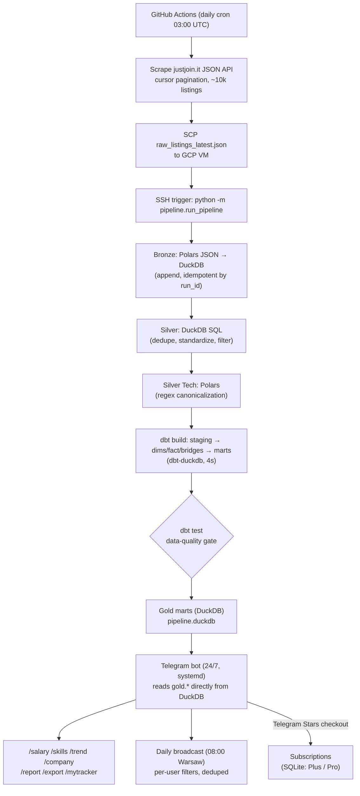
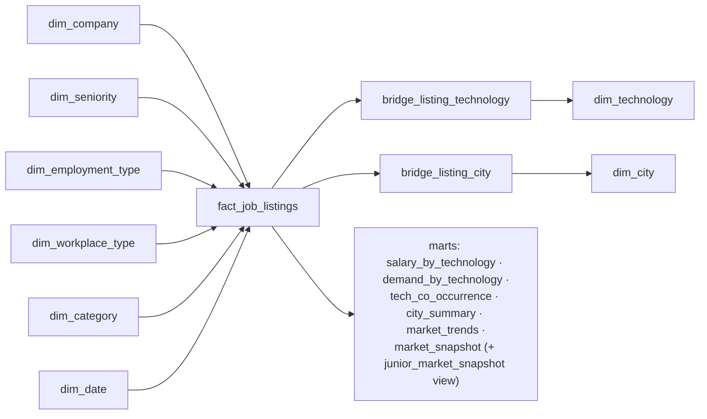

# Polish IT Job Market Intelligence

An end-to-end **data platform + monetizable product** for Poland's IT job market — built as a production-style portfolio project, not a tutorial. A scheduled scraper feeds a self-hosted medallion pipeline (bronze → silver → gold star schema via Polars + DuckDB + dbt) on a GCP e2-micro VM, and the gold marts power an **interactive Telegram bot** with free job alerts and a paid analytics tier (salary insights, skill co-occurrence, company intel, an application tracker) billed in **Telegram Stars**.

[](https://github.com/kromylodd/Polish-It-Job-Market-Intelligence/actions/workflows/ci.yml)
[](https://github.com/kromylodd/Polish-It-Job-Market-Intelligence/actions/workflows/scrape.yml)
[](#testing)
[](#tech-stack)

> **Stage 3 companion** to the [Polish Housing Market Intelligence Platform](https://github.com/kromylodd/Polish-Housing-Market-Intelligence-Platform) — deliberately built on a **different stack** (DuckDB / Polars / dbt-duckdb / systemd vs. GCP / BigQuery / Airflow / Terraform) to demonstrate cross-platform fluency, then taken one step further: this one ships a **user-facing product with a payment layer** on top of the warehouse.

**Status: pipeline + product both live.** Scraper → SCP to VM → local pipeline (Polars bronze/silver → dbt-duckdb star schema → dbt tests) runs daily via GitHub Actions; the interactive Telegram bot runs 24/7 as a systemd service reading gold marts directly from the pipeline's DuckDB file for sub-second premium analytics. See [Known Limitations](#known-limitations--honest-caveats) for the honest caveats.

---

## Table of Contents

- [Motivation](#motivation)
- [Architecture](#architecture)
- [Tech Stack](#tech-stack)
- [Key Differentiators vs. Project #1](#key-differentiators-vs-project-1-housing)
- [The Product: Telegram Bot](#the-product-telegram-bot)
- [Monetization (Telegram Stars)](#monetization-telegram-stars)
- [The Serving Layer: Why a Local DuckDB Cache](#the-serving-layer-why-a-local-duckdb-cache)
- [Data Model](#data-model)
- [Reliability Engineering](#reliability-engineering-the-hard-parts)
- [Project Structure](#project-structure)
- [CI/CD](#cicd)
- [Deployment](#deployment)
- [Testing](#testing)
- [Setup](#setup)
- [Known Limitations / Honest Caveats](#known-limitations--honest-caveats)
- [Roadmap](#roadmap)
- [Scraping Ethics](#scraping-ethics)
- [Disclaimer](#disclaimer)

## Motivation

Most portfolio data projects stop at "scrape → warehouse → dashboard nobody opens." This one closes the loop to an actual **product a user interacts with daily**: it answers "what should I learn, where should I apply, and what should I earn?" for the Polish IT market, and it has a real (if small-scale) revenue model. The engineering underneath is built the way an internal analytics platform would be — a medallion lakehouse, a Kimball-style star schema with many-to-many bridge tables, a data-quality gate, IaC, and CI/CD — but the consumption layer is a push-based Telegram bot instead of a pull-based BI dashboard, because that's what actually gets used by job seekers.

It also intentionally uses a completely different toolchain from my [first data platform](https://github.com/kromylodd/Polish-Housing-Market-Intelligence-Platform), so the two projects together show I can design the same class of system on both a **GCP-native** stack and a **self-hosted DuckDB/Polars/dbt** stack rather than knowing exactly one vendor. (This project began on Databricks Free Edition and was later migrated to the self-hosted pipeline — see [`docs/migration_plan.md`](docs/migration_plan.md).)

## Architecture



A single pipeline.duckdb file is both the warehouse and the serving layer:

- **Batch (daily):** GitHub Actions scrapes and SCPs the data to the VM; SSH triggers the local pipeline (Polars + dbt-duckdb, ~13s total). The gold marts land directly in the DuckDB file the bot reads.
- **Interactive (24/7):** the Telegram bot serves on-demand premium analytics from the same DuckDB file — no sync, no network, no cold starts. Sub-second response guaranteed.

## Tech Stack

| Category | Tools |
|---|---|
| Language | Python 3.12 |
| Pipeline processing | Polars 1.4 (bronze/silver), DuckDB 1.1 (analytical DB) |
| Modeling | dbt-duckdb — star schema with many-to-many bridge tables |
| Orchestration | GitHub Actions (scrape + SCP trigger) + systemd timer (fallback) |
| CI/CD | GitHub Actions (lint, format, tests, dbt-parse) |
| Data Quality | dbt tests (salary range, uniqueness, referential integrity) |
| Product | python-telegram-bot 21.5 (long-polling, JobQueue, inline menus) |
| Serving | DuckDB (bot reads gold.* tables directly from pipeline output) |
| Payments | Telegram Stars (`currency=XTR`, no third-party provider) |
| Bot state | SQLite (subscriptions, payments, application tracker, analytics, alert idempotency) — all created `0600` via a shared connection helper |
| Charts | matplotlib (Agg backend, headless PNG) |
| Hosting | GCP e2-micro free tier (systemd services for bot + pipeline) |

## Key Differentiators vs. Project #1 (Housing)

- **Self-hosted analytical pipeline** (Polars + DuckDB + dbt-duckdb) instead of GCP-native (BigQuery / GCS / Airflow / Terraform).
- **Single-file analytical database** (DuckDB) serves both pipeline and application — no separate warehouse vs. cache.
- **Many-to-many bridge tables** (technology, city) — a star-schema pattern project #1 didn't need.
- **A shipped product with a payment layer** — not just a dashboard. Telegram bot + Stars monetization + retention features.
- **Zero-dependency serving** — the bot reads directly from the pipeline's DuckDB output with no network, sync, or external service needed at query time.

## The Product: Telegram Bot

The gold marts aren't just for a dashboard — they back a live bot ([@polish_it_jobs_bot](https://t.me/polish_it_jobs_bot)) that job seekers actually use.

**Free (for everyone):**
- Daily push alerts of new listings matching per-user filters.
- A full universal filter system with **tolerance matching** — 7 dimensions (seniority, technologies, categories, workplace, employment type, min salary, cities) where the user sets how many dimensions are allowed to mismatch (`0` = strict, `1+` = flexible). Edited via an interactive inline-keyboard menu (`/filters`).
- `/myskills python sql airflow` — save your stack; `/latest` results get **ranked by % skill overlap** (a simple, explainable recommendation layer — no ML needed, but it reads like one).

**Premium (`/premium` menu, billed in Telegram Stars):**
- `/salary Python [senior]` — median plus a **P25–P75 typical range**, broken out **by contract type** (permanent/UoP vs B2B vs mandate), plus a per-seniority breakdown, from `mart_salary_by_technology`. Salary is period-normalized to a monthly basis upstream (per-hour/day/year quotes converted in `fact_job_listings`), so B2B and UoP are directly comparable — they're shown separately because they're genuinely different comp, not because of a units mismatch.
- `/skills Python` — "often requested with: SQL 71%, Airflow 43% …" from `mart_tech_co_occurrence`. **This is the standout feature — no other Polish job-alert bot does technology co-occurrence.**
- `/trend [tech]` — market-wide or per-technology demand trends, rendered as matplotlib charts.
- `/company Allegro` — how many current listings, salary range, sample roles.
- `/report` — a weekly market report (top hiring companies, hottest tech WoW, salary trend) + chart.
- `/export` — the user's filtered listings as a CSV.
- **Application tracker** — one-tap `✅ Applied / 👀 Interested / ❌ Rejected` buttons under each listing (and `/applied`, `/mytracker`). This is the main *retention* lever — it turns a broadcast channel into a personal tool users keep coming back to.

The `/premium` menu mirrors the free `/filters` menu: an inline keyboard where keyword-driven items show usage and action items run immediately — one shared code path behind both the slash command and the button.

## Monetization (Telegram Stars)

Payments use **Telegram Stars** (`currency="XTR"`, empty provider token) — no Stripe, no third-party processor, checkout handled inside Telegram. The full flow is wired: `send_invoice` → `PreCheckoutQuery` approval → `successful_payment` → subscription activation, with idempotent charge logging. The subscription **lifecycle** is handled too: a post-expiry **grace period** keeps access alive while a background job sends **renewal reminders**, and an admin `/refund <charge_id>` issues a Telegram Stars refund (`refundStarPayment`) and revokes access.

| Tier | Price | What you get |
|---|---|---|
| **Free** | — | Daily digest + all filters (up to 20 listings/run) |
| **Plus** | 250 ⭐ / 30 days | Saved-filter push, `/latest` on demand, `/salary`, `/trend`, up to 50 listings/run |
| **Pro** | 600 ⭐ / 30 days | Everything in Plus + `/skills` co-occurrence, `/company` intel, `/export`, application tracker, weekly report, up to 100 listings/run |

Feature gating respects a tier hierarchy (Pro ⊇ Plus), persisted in SQLite with expiry. Paid tiers also raise the per-run listing cap (free 20 → Plus 50 → Pro 100); the daily broadcast derives each user's cap directly from the subscription store (`payments.listing_cap`) since the bot and the broadcast run in the same process on the VM. Users can always see their remaining time — the `/premium` menu and `/subscribe` both show the expiry date and days left (or a grace-period note). The pricing is deliberately structured so **Pro needs only ~3–4 subscribers to match the net revenue of ~9 Plus subscribers** — selling fewer, more valuable subscriptions rather than racing to the bottom.

## The Serving Layer: Why a Single DuckDB File

The single most interesting engineering decision in the project.

**Problem:** premium commands must answer in well under a second. The original architecture used Databricks SQL warehouse queries, which could take tens of seconds on a cold Free Edition instance — or get throttled entirely.

**Solution:** the pipeline writes directly to `pipeline.duckdb`, and the bot reads from the same file. No sync step, no network hop, no cold starts. The gold marts are small (hundreds to a few thousand rows), so the entire star schema fits in ~15 MB. The bot opens the file with `read_only=True`; the pipeline writes with WAL mode so reads are never blocked.

This is a **zero-dependency serving architecture**: the bot can answer any premium query even if the network is down, GitHub Actions is broken, or the pipeline hasn't run in days (it just serves slightly stale data). Same architectural pattern as a materialized-view cache in front of a slow warehouse, but with zero infrastructure beyond the file itself.

## Data Model

**Medallion architecture** (DuckDB schemas):
- `bronze` — raw ingested listings, append-only (Polars reads JSON, writes to DuckDB).
- `silver` — cleaned, deduplicated, tech-parsed listings (DuckDB SQL + Polars).
- `gold` — star schema: dimensions, fact, bridges, and analytical marts (dbt-duckdb).

**Star schema (gold):**



A single listing can require many technologies and span multiple cities, so `bridge_listing_technology` and `bridge_listing_city` model those many-to-many relationships rather than flattening or exploding the fact table.

**Marts (each backs a bot command):**

| Mart | Powers |
|---|---|
| `mart_salary_by_technology` | `/salary <tech>` — percentiles per tech/seniority/contract |
| `mart_tech_co_occurrence` | `/skills <tech>` — which technologies appear together |
| `mart_demand_by_technology` | `/trend <tech>` — weekly demand + WoW change |
| `mart_market_trends` | `/trend`, `/report` — rolling volume & salary trend |
| `mart_city_summary` | city-level listings & salary rollups |
| `mart_market_snapshot` | daily alerts + `/latest` + `/company` (all seniorities) |
| `mart_junior_market_snapshot` | junior-only view over `mart_market_snapshot` (backward-compat) |

## Reliability Engineering (the hard parts)

Real failures hit and fixed during development — the interesting part of a data product isn't the happy path:

- **Databricks double-trigger bug.** Two overlapping mechanisms (file-arrival trigger + explicit API `run-now`) caused the pipeline to run twice per scrape. Fixed by eliminating file-arrival, using API-only triggering, and switching to a fixed filename to prevent file accumulation.
- **Cold-warehouse hang froze the bot.** The original serving layer queried Databricks SQL on demand with a 900-second retry default. Fixed by migrating to a local DuckDB architecture where the bot reads directly from the pipeline output — zero network, zero cold starts, sub-millisecond queries.
- **Upload flakiness from GitHub → Databricks.** A ~39 MB JSON stalled mid-transfer on TLS churn; fixed by gzipping the payload (~10×) and prewarming. After migration: eliminated entirely — SCP of a 14 MB JSON to the same-datacenter VM is instant and reliable.
- **Polars/DuckDB type mismatch during migration.** Polars `map_elements` on List columns passes a `pl.Series`, not a Python list — the tech canonicalization function needed conversion. Caught by end-to-end testing before merge.
- **JSON array unnest in dbt.** DuckDB can't `LATERAL VIEW EXPLODE` like Spark. Solved with a `json_array_length` + `range` + `unnest` pattern that indexes into the JSON array by position.
- **Multi-user & idempotency bugs.** Per-user config isolation (atomic writes, no shared-list mutation), a per-`(listing, chat)` idempotency log so alerts never duplicate.

**Post-migration hardening pass** (a full code review, then fixes — see git history):

- **No lost payments on restart.** The bot no longer drops pending updates on startup, and payment handling is fully idempotent: `record_and_activate` records the charge and grants access in a single transaction keyed on `charge_id`, so a redelivered `successful_payment` can't double-stack a subscription and a restart mid-payment can't drop it.
- **Billing data isn't world-readable.** All SQLite stores go through one connection helper that enforces `0600`, and the systemd units set `UMask=0077`.
- **Serving fast-path actually engages.** Fixed a latent bug where the on-demand cache query used the wrong (unqualified) table name and silently fell through; it now reads `gold.mart_market_snapshot` via `fetchall()` (no pandas dependency at runtime).
- **Pipeline DB is read-only from the bot.** The alert idempotency log moved out of `pipeline.duckdb` into its own SQLite file, so the bot never contends for a write lock on the pipeline's analytical DB.
- **Stable tracker pagination.** Pages are fetched in SQL ordered by a stable key (`created_at`), so re-marking a listing's status can't shift rows across page boundaries.
- **Hot-path subscription lookups** are served from a short-TTL cache (invalidated on every mutation) to keep SQLite reads off the async event loop.

## Project Structure

```
polish-it-job-market-intelligence/
├── pipeline/
│   ├── __init__.py                 # Config (DB path, schemas, data dir)
│   ├── bronze_ingest.py            # Polars: JSON → DuckDB append (idempotent)
│   ├── silver_clean.py             # DuckDB SQL: dedup + standardize
│   ├── silver_tech_parse.py        # Polars: regex tech canonicalization
│   └── run_pipeline.py             # Orchestrator (bronze → silver → dbt)
├── scraper/
│   ├── scraper.py                  # justjoin.it JSON API, cursor pagination, retries
│   ├── parser.py                   # typed field extraction + normalization
│   └── tests/                      # parser unit tests
├── dbt/
│   ├── models/staging/             # stg_listings (view over silver.listings_with_tech)
│   ├── models/marts/{dims,facts,bridges,analytics}/  # star schema + 7 marts
│   ├── snapshots/ · tests/ · seeds/
│   └── profiles.yml                # dbt-duckdb (local + ci targets)
├── telegram_bot/
│   ├── bot.py                      # commands, inline menus, payment flow, JobQueue
│   ├── filters.py                  # universal tolerance-matching filter logic
│   ├── serving.py                  # reads gold.* directly from pipeline DuckDB
│   ├── payments.py                 # Telegram Stars subscriptions (SQLite) + cache
│   ├── tracker.py                  # application tracker (SQLite, paginated)
│   ├── reports.py                  # weekly report + matplotlib charts
│   ├── dbutil.py                   # shared SQLite helper (0600 perms + locking)
│   ├── notify.py / config_store.py / analytics.py
│   └── tests/                      # filters, analytics, config, serving, tracker, payments, bot_data
│   # runtime SQLite (gitignored): payments.db · tracker.db · analytics.db · alerts.db
├── deploy/
│   ├── setup_vm.sh                 # one-shot: both venvs + both services + timer
│   ├── pipeline.service            # systemd oneshot (pipeline run)
│   ├── pipeline.timer              # daily fallback timer (04:00 UTC)
│   ├── Dockerfile                  # bot image (non-root, headless matplotlib)
│   └── README.md                   # GCP e2-micro free-tier hosting guide
├── pipeline-requirements.txt       # polars, duckdb, dbt-core, dbt-duckdb
├── docs/
│   ├── migration_plan.md           # full Databricks → DuckDB migration plan
│   └── architecture_decisions.md   # ADRs
└── .github/workflows/
    ├── ci.yml                      # lint, format, tests, dbt-parse
    └── scrape.yml                  # daily scrape → SCP → SSH trigger pipeline
```
## CI/CD

**`.github/workflows/ci.yml`** — on every push/PR to `main`:

| Job | What it does |
|---|---|
| `lint-and-test` | `ruff check .`, `ruff format --check .`, `black --check .`, `pytest` (113 tests) |
| `dbt-parse` | `dbt deps` + `dbt parse` (pinned dbt-duckdb) to catch model errors early |

**`.github/workflows/scrape.yml`** — daily (03:00 UTC) + manual: scrape → verify output → SCP to VM → SSH trigger pipeline → verify pipeline success. No Databricks involvement.

## Deployment

The bot is long-polling (no inbound ports), so any always-on Linux box works.

- **systemd (used now):** two user services on a GCP e2-micro — the bot (`telegram-bot.service`) and the pipeline (`pipeline.service` + `pipeline.timer`). `loginctl enable-linger` so both survive logout/reboot.
- **Docker:** `deploy/Dockerfile` builds a non-root image with a persistent volume for the SQLite stores + DuckDB file.
- **One-shot deploy:** `./deploy/setup_vm.sh` creates both venvs, installs all deps, registers both services and the timer.

## Testing

```bash
pip install -r requirements-ci.txt
PYTHONPATH=. pytest -q   # 113 tests: scraper parser, filters, analytics, config,
                         # serving layer, application tracker (+ pagination),
                         # Stars payments (idempotent activation, refunds, cache),
                         # daily-broadcast caps, reports, local-cache reader
```

The serving/reports/bot-data tests seed a temporary DuckDB with sample gold-schema marts so the analytics helpers (weighted salary aggregation, co-occurrence %, skill ranking, chart PNG generation) and the bot's local-cache reader are exercised for real, not skipped. `requirements-ci.txt` includes duckdb + matplotlib so CI runs them too.

## Setup

### Prerequisites
- Python 3.12
- A Telegram bot token (via [@BotFather](https://t.me/BotFather))
- A VM with SSH access (for the pipeline; GCP e2-micro free tier recommended)

### Pipeline (local development)
```bash
git clone https://github.com/kromylodd/Polish-It-Job-Market-Intelligence.git
cd polish-it-job-market-intelligence
pip install -r pipeline-requirements.txt
cd dbt && dbt deps --profiles-dir . && cd ..
# Run pipeline against a data file:
python -m pipeline.run_pipeline --data-file data/raw_listings_latest.json
```

### Bot (local)
```bash
pip install -r telegram_bot/requirements.txt
cp .env.example .env && chmod 600 .env    # then fill in real values
set -a && source .env && set +a           # TELEGRAM_BOT_TOKEN, ANALYTICS_SALT, PIPELINE_DB_PATH
python3 -m telegram_bot.bot
```

Key env vars: `TELEGRAM_BOT_TOKEN`, `TELEGRAM_CHAT_ID` (admin), `ANALYTICS_SALT`, `PIPELINE_DB_PATH` (defaults to `./pipeline.duckdb`).

### Deploy to VM
```bash
# On the VM:
git clone <repo> ~/polish-it-job-market-intelligence
cd ~/polish-it-job-market-intelligence
cp /path/to/.env .env && chmod 600 .env
./deploy/setup_vm.sh
```

## Known Limitations / Honest Caveats

Documented deliberately — a recruiter should see engineering judgment about trade-offs, not just green checkmarks.

- **Single-node hosting.** systemd on one VM means no HA; if the VM is down, alerts pause. Fine for the current scale.
- **~10k listing cap per scrape** from justjoin.it's API pagination — a representative daily snapshot, not a full census, for the very largest result sets.
- **DuckDB write lock during pipeline.** While the pipeline runs (~13s), a simultaneous bot query could briefly wait. WAL mode minimizes this; the pipeline runs at 03:00 UTC when users are asleep.
- **Payments are wired but lightly exercised.** The full Stars checkout flow is implemented and unit-tested — including a subscription lifecycle (post-expiry grace period, background renewal reminders, and admin-issued Stars refunds that revoke access) — but real-world volume is minimal.
- **SSH-based trigger from GitHub Actions** requires a deploy key in secrets. If the VM IP changes (rare on GCP), the secret needs updating.

## Roadmap

- ~~Trend chart cleanup: drop the partial first day so week-over-week isn't inflated.~~ ✅ Done.
- ~~All-seniorities gold mart so premium alerts cover senior/mid, not just junior.~~ ✅ Done.
- ~~Real payment lifecycle: refunds, grace periods, renewal reminders.~~ ✅ Done.
- ~~Lower the scrape delay now that 429 `Retry-After` handling exists.~~ ✅ Done (0.5s).
- ~~Move the bot to a free-tier cloud VM for true 24/7 independence from a laptop.~~ ✅ Done — GCP `e2-micro` in `us-west1-b`.
- ~~Migrate pipeline off Databricks Free Edition.~~ ✅ Done — self-hosted Polars + DuckDB + dbt-duckdb.
- ~~Delete legacy Databricks files after validation period.~~ ✅ Done — notebooks, DAB bundle, Volume uploader, and dashboards removed.
- [ ] Add historical trend data (backfill from archived raw-scrape snapshots).
- [ ] Off-box nightly backup of `payments.db` (billing data) to object storage.

## Scraping Ethics

- Only publicly available listing data via justjoin.it's own JSON API — no authenticated endpoints, no HTML scraping, no bypassing access controls.
- Requests are rate-limited (0.5s delay, env-tunable) with exponential backoff and `Retry-After` handling on 429s.
- Scope is search-results fields only.

## Disclaimer

This project scrapes only publicly available data for educational/portfolio purposes. It is not affiliated with justjoin.it. Salary and market figures are derived from public job postings and are not financial advice.
